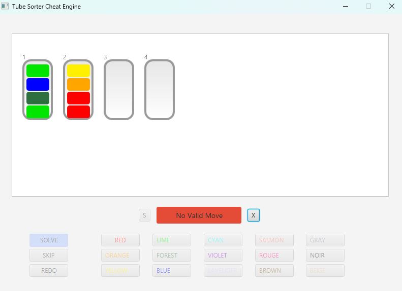

# Tube Sorter Engine

A program that **automatically solves and simulates tube sorting puzzles**, demonstrating efficient pathfinding.
Implements **Breadth-First Search (BFS)** to compute optimal moves.  

**Features:**
- Generates a **Move Log** to show the step-by-step order of moves for the shortest solution path.
- Reset, Simulate Again, Redo, and Skip buttons to control the puzzle, allowing users to reset, watch animations, or step back moves easily.
- Step-by-step animation simulates the sorting process for better visualization.
- Error handling for user input to catch invalid values such as incorrect number of liquids or out-of-range balances, ensuring the program runs smoothly.

**Limitations:**
- Tube creation is limited to **<= 6 tubes**, due to BFS' nature, to optimize memory usage and performance.

**Technologies:** Java, JavaFX

**Demonstration:**  
**BEFORE**  

**AFTER**  

**ERROR HANDLING**  

